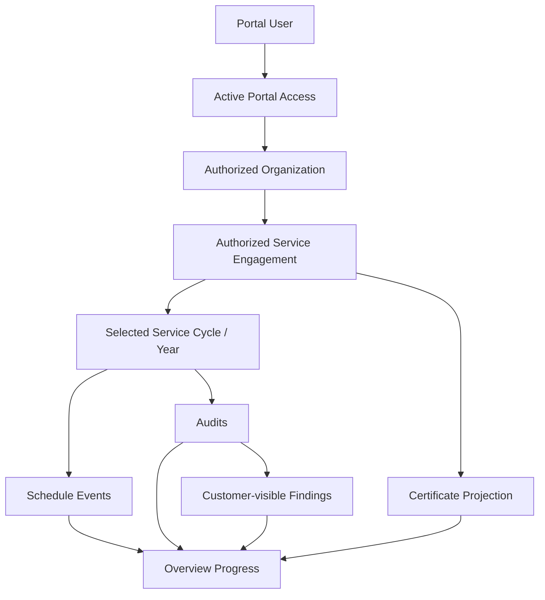

# Phase 1D Customer Portal ERD

This diagram shows only the Phase 1D customer-portal extension and the core tables it depends on.

```mermaid
erDiagram
    USERS ||--o{ CUSTOMER_PORTAL_ACCESS : receives
    CONTACTS ||--o{ CUSTOMER_PORTAL_ACCESS : may_link
    ORGANIZATIONS ||--o{ CUSTOMER_PORTAL_ACCESS : scopes
    AUDITS ||--o{ CUSTOMER_PORTAL_ACCESS : may_restrict

    ORGANIZATIONS ||--o{ SITES : has
    ORGANIZATIONS ||--o{ SERVICE_ENGAGEMENTS : receives
    SCHEMES ||--o{ SERVICE_ENGAGEMENTS : defines
    CERTIFICATIONS ||--o{ SERVICE_ENGAGEMENTS : may_support

    SERVICE_ENGAGEMENTS ||--o{ SERVICE_ENGAGEMENT_SITES : covers
    SITES ||--o{ SERVICE_ENGAGEMENT_SITES : participates

    SERVICE_ENGAGEMENTS ||--o{ SERVICE_CYCLES : has
    SERVICE_CYCLES ||--o{ AUDIT_SERVICE_CYCLES : groups
    AUDITS ||--o{ AUDIT_SERVICE_CYCLES : participates
    SCHEMES ||--o{ AUDIT_SERVICE_CYCLES : qualifies

    ORGANIZATIONS ||--o{ AUDIT_SCHEDULE_EVENTS : owns
    SERVICE_ENGAGEMENTS ||--o{ AUDIT_SCHEDULE_EVENTS : relates
    SERVICE_CYCLES ||--o{ AUDIT_SCHEDULE_EVENTS : relates
    AUDITS ||--o{ AUDIT_SCHEDULE_EVENTS : may_create
    SITES ||--o{ AUDIT_SCHEDULE_EVENTS : occurs_at

    CUSTOMER_PORTAL_ACCESS ||--o{ CUSTOMER_PORTAL_SITE_ACCESS : limits
    SITES ||--o{ CUSTOMER_PORTAL_SITE_ACCESS : permits

    CUSTOMER_PORTAL_ACCESS ||--o{ CUSTOMER_PORTAL_SERVICE_ACCESS : limits
    SERVICE_ENGAGEMENTS ||--o{ CUSTOMER_PORTAL_SERVICE_ACCESS : permits

    USERS ||--o{ PORTAL_DASHBOARD_PREFERENCES : owns
    ORGANIZATIONS ||--o{ PORTAL_DASHBOARD_PREFERENCES : selects
    SERVICE_ENGAGEMENTS ||--o{ PORTAL_DASHBOARD_PREFERENCES : selects
    SITES ||--o{ PORTAL_DASHBOARD_PREFERENCES : selects

    USERS ||--o{ PORTAL_ACTIVITY_LOG : performs
    ORGANIZATIONS ||--o{ PORTAL_ACTIVITY_LOG : scopes

    AUDITS ||--o{ FINDINGS : raises
    FINDINGS ||--o{ FINDING_CUSTOMER_RESPONSES : receives
    USERS ||--o{ FINDING_CUSTOMER_RESPONSES : submits

    AUDITS ||--o{ AUDIT_DOCUMENTS : contains
    AUDIT_DOCUMENTS ||--o{ DOCUMENT_PUBLICATIONS : publishes
```

## Logical customer-service projection

## Important modeling decisions

1. The portal does not duplicate Audit records.
2. `service_engagements` is a portal aggregation identity, not a contract ledger.
3. `service_cycles` supports year/cycle navigation without placing presentation fields on `audits`.
4. `audit_schedule_events` separates scheduling from audit execution.
5. Site and service authorization are narrower scopes beneath `customer_portal_access`.
6. Dashboard preferences are not permissions.
7. Contracts, Financials and Trainings remain integration boundaries until detailed BA is available.

