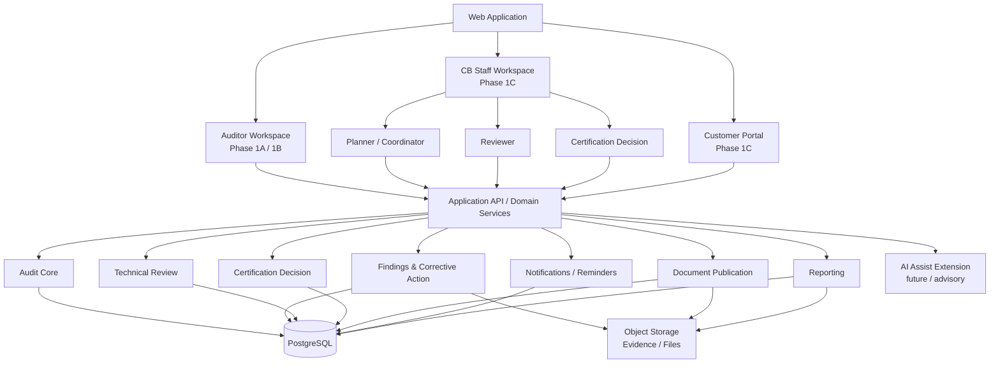
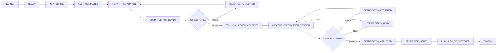
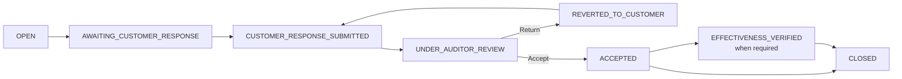
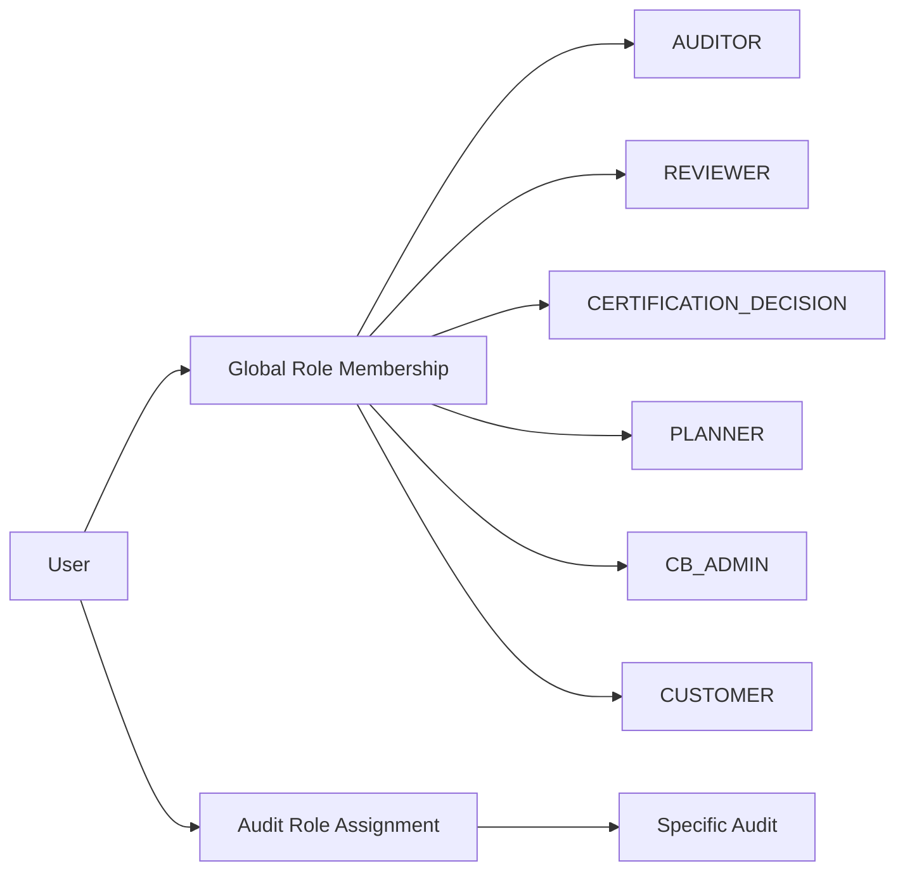
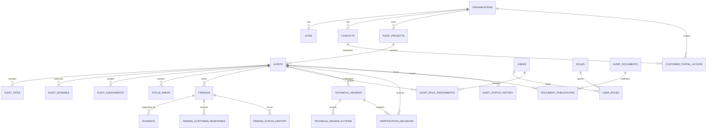

# CB Auditor Webapp Community

> An open reference architecture and experimental implementation model for modern web-based conformity-assessment and ISO management-system auditing workflows.

**Community Maintainer:** HQC AI  
**Author & Project Lead:**  
Nguyễn Đăng Quang  
Lead Auditor ISO/IEC 27001, ISO/IEC 42001, ISO/IEC 27701  
Project Lead – AI Governance and AIMS Platform Development

[](LICENSE)


---

## What this project is

**CB Auditor Webapp Community** is an independent community reference architecture for digital auditing and conformity-assessment workflows.

It is intended for:

- auditors and lead auditors;
- certification and conformity-assessment professionals;
- software engineers and architects;
- consultants and trainers;
- researchers working on digital assurance;
- contributors exploring responsible AI-assisted auditing.

The project is **not a clone of any commercial auditor application**. It captures generic workflow lessons, independently described domain models, reusable software patterns and original Community Edition implementation guidance.

The architecture is intentionally web-first, structured-data-first and suitable for incremental implementation.

## Why this project exists

Professional audits generate much more than a final report. A complete workflow may involve audit planning, assignments, evidence, findings, customer corrective actions, audit conclusions, technical review, certification decisions, controlled publication and historical traceability.

Traditional document-centric workflows often scatter these records across files, email and disconnected systems.

CB Auditor Webapp Community treats structured audit data as the system of record and generates reports, customer views and review packages from that data.

The design aims to improve:

- auditor productivity;
- audit consistency;
- evidence traceability;
- finding and corrective-action management;
- report generation;
- technical review;
- certification workflow separation;
- customer communication;
- audit knowledge reuse;
- future responsible AI assistance.

---

# Community Architecture Baseline

The current Community baseline consists of three connected sub-phases.

| Phase | Purpose | Main actors | Community status |
|---|---|---|---|
| **Phase 1A** | Application shell, audit list and core audit metadata | Auditor | Baseline |
| **Phase 1B** | Detailed audit execution workspace | Auditor, Lead Auditor | Baseline |
| **Phase 1C** | CB operations and controlled customer interaction | Reviewer, Certification Decision, Planner, Customer | **Added to Community baseline** |

## Phase 1A — Application Foundation

Phase 1A establishes the web application shell and core data relationships:

- Audit List / Work Queue;
- create and open an audit;
- organizations, sites and schemes;
- audit dates and audit type;
- audit assignments;
- multi-site and multi-scheme-ready relationships;
- separation between internal data and customer-visible output.

Authentication and offline synchronization are intentionally not required for the initial Community demonstration.

## Phase 1B — Auditor Workspace

Phase 1B provides the structured audit execution workspace:

- Current / Historical Audit Overview;
- Focus Areas;
- Findings;
- Evidence;
- Customer finding responses;
- Management Summary;
- Conclusions;
- Auditor Statements;
- Audit Completion;
- Report / presentation generation;
- Technical Summary;
- Technical Review architecture hooks.

AI may assist with drafting or consistency checks, but AI output remains non-authoritative until reviewed and accepted by an auditor.

## Phase 1C — CB Operations & Customer Portal

Phase 1C extends the same audit record into post-audit Certification Body operations and controlled customer interaction.

It adds:

- role-aware CB staff workspace;
- Reviewer / Technical Review workflow;
- Certification Decision workflow;
- Planner / Audit Coordinator workflow;
- Customer Portal authorization;
- versioned customer corrective-action responses;
- evidence upload for corrective actions;
- controlled document publication;
- manual reminders and notification records;
- workflow history and audit trails;
- segregation-of-duties rules.

**Core Phase 1C principle:** there is still one Audit object and one primary data model. Reviewer, decision maker, planner and customer experiences are projections over the same governed business records; audit data is not copied into separate role-specific systems.

---

## High-Level Architecture



The recommended Community implementation remains a **modular monolith** first. Domain boundaries are explicit in code and data even when the application is deployed as one service.

---

## End-to-End Audit Workflow



Workflow states are explicit domain transitions, not unrestricted edits of a status field. Each material transition should record actor, timestamp, previous state, next state and an optional reason.

---

## Finding & Corrective-Action Workflow



The customer may provide:

- Correction;
- Root Cause;
- Corrective Action;
- supporting Evidence.

Submitted responses are versioned. Customers cannot modify the auditor's finding text, requirement reference, classification or auditor evidence.

---

## Major Application Modules

| Module | Purpose | Primary actors |
|---|---|---|
| Audit List / Work Queue | Entry point for scheduled and active audits | Auditor, Lead Auditor |
| Audit Overview | Organization, sites, schemes, team, dates, scope and status | Auditor |
| Focus Areas | Reusable assessment themes and structured summaries | Auditor |
| Findings & Evidence | Structured findings and supporting evidence | Auditor |
| Corrective Action | Customer response, evidence, auditor disposition | Customer, Auditor |
| Management Summary | Structured audit-level summary | Lead Auditor |
| Conclusions | Controlled audit-level conclusions and recommendation | Lead Auditor |
| Statements | Structured assessment topics and audit narrative | Auditor |
| Reporting | Generate outputs from structured data | Lead Auditor |
| Reviewer Workspace | Independent technical review | Reviewer |
| Certification Decision | Independent certification decision checkpoint | Decision Maker |
| Planner Workspace | Scheduling, assignments, publication and reminders | Planner |
| Customer Portal | Restricted customer-specific audit projection | Customer |
| Document Publication | Explicit internal/customer publication state | Planner / configured role |
| Audit Trail | Append-only workflow traceability | System |
| AI Assist | Draft/check support with human acceptance | Auditor |

---

## Role and Segregation-of-Duties Model

A person's **global role** and their **assignment to a specific audit** are separate concepts.



Typical controls:

- a Reviewer must be assigned to the audit;
- a Certification Decision maker must be assigned to the audit;
- self-review and self-approval should be prevented unless an explicit policy exception exists;
- certification approval requires accepted technical review;
- Planner may coordinate and remind but cannot accept or close findings;
- customer visibility requires both authorization and explicit publication.

---

## Domain Model Overview



See:

- [Phase 1A Application Architecture](docs/architecture/phase-1a-application-architecture.md)
- [Phase 1B Audit Workspace Architecture](docs/architecture/phase-1b-audit-workspace-architecture.md)
- [Phase 1C CB Operations & Customer Portal](docs/architecture/phase-1c-cb-operations-customer-portal.md)
- [Phase 1C Data Model Extension](docs/architecture/phase-1c-data-model-extension.md)
- [Role & Permission Model](docs/domain/role-permission-model.md)
- [Review & Certification Workflow](docs/domain/review-certification-workflow.md)
- [Customer Portal Model](docs/domain/customer-portal-model.md)
- [Full ERD](database/ERD.md)

---

## Repository Structure

```text
certification-body-auditor-webapp-community/
├── README.md
├── assets/
│   └── donate-qr.png
│
├── docs/
│   ├── architecture/
│   │   ├── phase-1a-application-architecture.md
│   │   ├── phase-1b-audit-workspace-architecture.md
│   │   ├── phase-1c-cb-operations-customer-portal.md
│   │   ├── phase-1c-data-model-extension.md
│   │   └── database-data-model-architecture.md
│   │
│   ├── domain/
│   │   ├── domain-model.md
│   │   ├── audit-lifecycle.md
│   │   ├── finding-lifecycle.md
│   │   ├── report-model.md
│   │   ├── role-permission-model.md
│   │   ├── review-certification-workflow.md
│   │   └── customer-portal-model.md
│   │
│   └── roadmap/
│       └── community-roadmap.md
│
├── database/
│   ├── schema.sql
│   ├── phase-1c-extension.sql
│   ├── seed-demo.sql
│   └── ERD.md
│
├── CONTRIBUTING.md
├── SECURITY.md
├── LICENSE
├── LICENSE-NOTE.md
├── COMMUNITY_MIGRATION_REPORT.md
└── PHASE_1C_COMMUNITY_MIGRATION_REPORT.md
```

---

## Phase 1C API Boundary

The following resource shapes are architectural guidance rather than a final API contract.

| Boundary | Example resources | Responsibility |
|---|---|---|
| Audit | `/audits`, `/audits/{id}/status` | Audit master and workflow transition |
| Assignment | `/audits/{id}/assignments` | Auditor, reviewer, decision maker, planner assignments |
| Review | `/reviews`, `/reviews/{id}/actions` | Technical review lifecycle |
| Certification Decision | `/decisions` | Independent certification decision |
| Findings | `/findings`, `/responses` | Findings and customer corrective action |
| Documents | `/documents`, `/publications` | File metadata and controlled publication |
| Portal | `/portal/audits`, `/portal/findings` | Customer-scoped projections |
| Notifications | `/notifications`, `/reminders` | In-app notification and reminder events |

Customer Portal endpoints must enforce server-side organization/audit authorization and must not rely on UI hiding for confidentiality.

---

## Phase 1 Community MVP Scope

The Community Phase 1 baseline now demonstrates the architecture for:

1. Auditor input workspace
2. Audit planning and assignment information
3. Audit execution workspace
4. Focus area management
5. Findings management
6. Evidence management
7. Management summary
8. Audit conclusions
9. Auditor statements
10. Report generation
11. Technical review
12. Certification decision
13. Planner / coordination queues
14. Customer corrective-action workflow
15. Customer-visible audit output
16. Controlled document publication
17. Audit and finding history
18. Core relational database and data model

The Community MVP may use simplified or seeded identities. Production authentication, identity federation and enterprise integrations are deferred.

---

## Explicitly Deferred

The following are intentionally outside the Community Phase 1 baseline:

- production-grade identity federation / SSO;
- complex multi-tenant Certification Body hierarchy;
- automated accreditation-specific certificate generation;
- full competence eligibility engine;
- scheme-specific certification-rule engine;
- qualified electronic signatures;
- ERP / CRM / finance integration;
- automated email/SMS escalation;
- advanced analytics;
- autonomous AI decisions.

---

## AI Governance Principle

AI should support auditors and reviewers, not replace professional judgement.

Future AI capabilities should preserve:

- human review and explicit acceptance;
- source evidence;
- traceability to the originating audit record;
- explainable suggestions;
- version history;
- separation of AI drafts from approved content;
- prohibition on autonomous certification decisions.

---

## Database

PostgreSQL is the reference relational database.

Core records remain normalized. Files and evidence binaries should be stored in S3-compatible object storage, while PostgreSQL stores metadata, ownership, lifecycle and publication information.

For an existing Phase 1A/1B database, apply the Community Phase 1C reference extension:

```bash
psql <database> < database/phase-1c-extension.sql
```

This file is an architecture-oriented reference migration. Review and adapt it before production use.

---

## Current Development Status

**Status:** Community architecture baseline — Phase 1A + Phase 1B + Phase 1C.

The repository documents the domain architecture and relational model. It does not claim that every documented module has been implemented as production software.

Phase 1C promotes Reviewer, Certification Decision, Planner and Customer Portal concepts into the Community architecture baseline while keeping authentication and enterprise integration deliberately lightweight for demonstration purposes.

---

## Roadmap

See [Community Roadmap](docs/roadmap/community-roadmap.md).

The roadmap distinguishes between:

- the **documented Community architecture baseline**;
- the **reference implementation**;
- later production hardening and optional extensions.

---

## Contribution Guidance

Contributions are welcome when they preserve the project's independence, auditability and professional-use principles.

Please do not submit:

- confidential audit data;
- customer personal information;
- real certificate identifiers;
- proprietary screenshots;
- third-party source code;
- copyrighted documentation extracts;
- secrets, credentials or internal URLs.

Contributors should favor generic terminology and reusable conformity-assessment domain concepts.

---

## ❤️ Support the Project

CB Auditor Webapp Community is developed as an open community initiative to explore better digital tools for professional auditing, conformity assessment and responsible AI-assisted audit workflows.

Community support helps with:

- continued Auditor Webapp development;
- audit workflow modules;
- database and reporting improvements;
- responsible AI-assisted auditing research;
- ISO/IEC 42001 and AI governance features;
- documentation and community examples;
- maintaining free and open community resources.

### Donate

<!-- The project owner may add the donation QR image before publication. -->

### Bank transfer — Vietnam & International

- **Bank:** Shinhan Bank Vietnam
- **Account holder:** NGUYEN DANG QUANG
- **Account number:** `0944659937`
- SWIFT/BIC: `SHBKVNVX`
- **Transfer reference:** `DONATE CB Auditor Webapp`

<p align="center">
  
</p>

### USDT — TRON (TRC20)

- **Asset:** Tether — USDT
- **Network:** TRON — TRC20
- **Receiving address:** `TPNDgQnemyVjjhAuwSPSJz37BCaQrUkaj9`

<p align="center">
  
</p>

**Thank you for supporting the development of open tools for the auditing and conformity-assessment community.**

Donation is completely optional and does not provide preferential access, certification benefits, audit outcomes or influence over professional assessment activities.

---

## Disclaimer

CB Auditor Webapp Community is an independent community project and reference architecture.

The architecture may incorporate general lessons learned from professional auditing practice, business analysis and research into auditing workflows. Research into third-party systems does not imply affiliation, endorsement, certification, approval or sponsorship.

No third-party proprietary software, source code, screenshots, confidential implementation materials or protected product documentation are intended to be distributed as part of the Community Edition.

This repository is a software and architecture reference. It does not itself perform certification, grant certification status, make certification decisions, or replace applicable accreditation, scheme, legal, contractual or professional requirements.

---

## Author & Project Attribution

**Primary author / architecture lead**

Nguyễn Đăng Quang  
Lead Auditor ISO/IEC 27001, ISO/IEC 42001, ISO/IEC 27701  
Project Lead – AI Governance and AIMS Platform Development

Please preserve this attribution when redistributing or transforming the architecture documentation, subject to the repository license.

---

## License

See [LICENSE](LICENSE) and [LICENSE-NOTE.md](LICENSE-NOTE.md).
