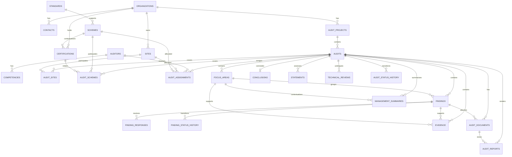

# Entity Relationship Diagram

**Primary author / architecture lead**  
Nguyễn Đăng Quang  
Lead Auditor ISO/IEC 27001, ISO/IEC 42001, ISO/IEC 27701  
Project Lead – AI Governance and AIMS Platform Development  
NQA Viet Nam

This ERD corresponds to [schema.sql](schema.sql).

## Cardinality Notes

- Audit-to-site and audit-to-scheme are many-to-many through join entities.
- Audit-to-auditor is many-to-many through `audit_assignments`; one person can hold multiple audit-context assignments.
- A finding can have many response versions and many lifecycle history records.
- `conclusions` is one-per-audit in the Phase 1 schema; statements and summaries are one-to-many.
- Evidence may link to an audit generally or optionally to a finding/focus area.
- Technical review is separate from audit state and may support multiple review iterations.

## Object Storage Boundary

Binary evidence and generated report files are stored outside PostgreSQL. `evidence.storage_key` and `audit_documents.storage_key` are references into the chosen S3-compatible object storage implementation.
