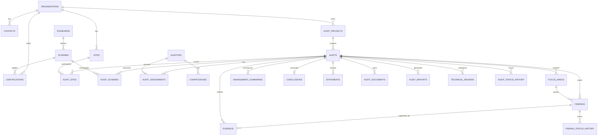
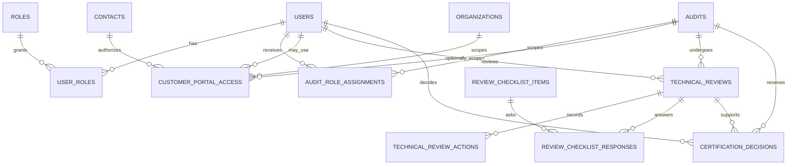
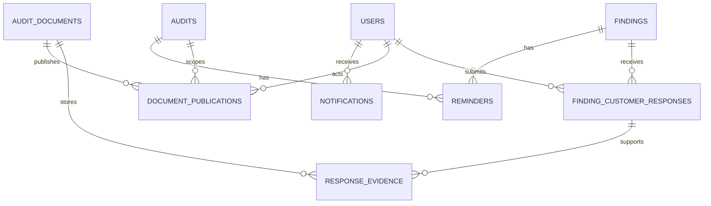

# Entity Relationship Diagram — Community Phase 1A / 1B / 1C

**Primary author / architecture lead**  
Nguyễn Đăng Quang  
Lead Auditor ISO/IEC 27001, ISO/IEC 42001, ISO/IEC 27701  
Project Lead – AI Governance and AIMS Platform Development

This document shows the Community relational model at two levels:

1. a readable high-level domain ERD;
2. Phase 1C operational extensions.

The SQL extension is in [`phase-1c-extension.sql`](phase-1c-extension.sql).

## 1. High-Level Community ERD

## 2. Phase 1C Identity & Operations ERD

## 3. Customer Corrective Action & Publication ERD

## 4. Important Cardinality Notes

- One organization may have many projects/audits and many customer contacts.
- Audit-to-site and audit-to-scheme are many-to-many through association tables.
- Auditor assignment data is separate from the auditor master.
- Global user roles are separate from audit-specific role assignments.
- An audit may have multiple Technical Review cycles over time.
- A Certification Decision references the Technical Review used as its prerequisite.
- A finding may have many customer response versions.
- A response may have multiple evidence documents.
- A document may have many publication events or audience records.
- Customer portal access does not imply that all audit documents are visible.

## 5. Object Storage Boundary

Binary files should remain outside PostgreSQL in S3-compatible object storage.

Relational records retain:

- storage key;
- MIME type;
- checksum/hash;
- ownership;
- audit/finding/response relationship;
- publication state;
- actor and timestamps.

## 6. Authorization Boundary

The ERD intentionally models both:

- **who may access an audit** (`customer_portal_access`, role assignments); and
- **what may be exposed** (`document_publications`, domain visibility rules).

These are separate controls.
