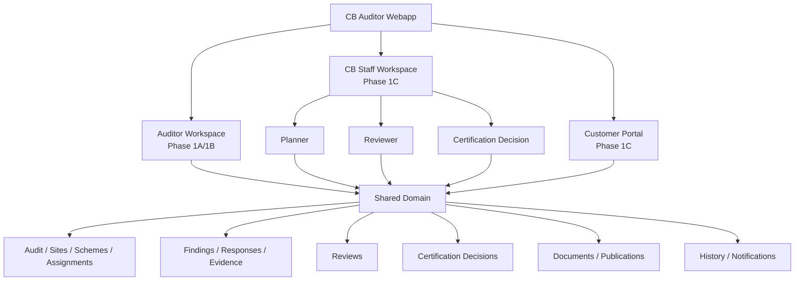
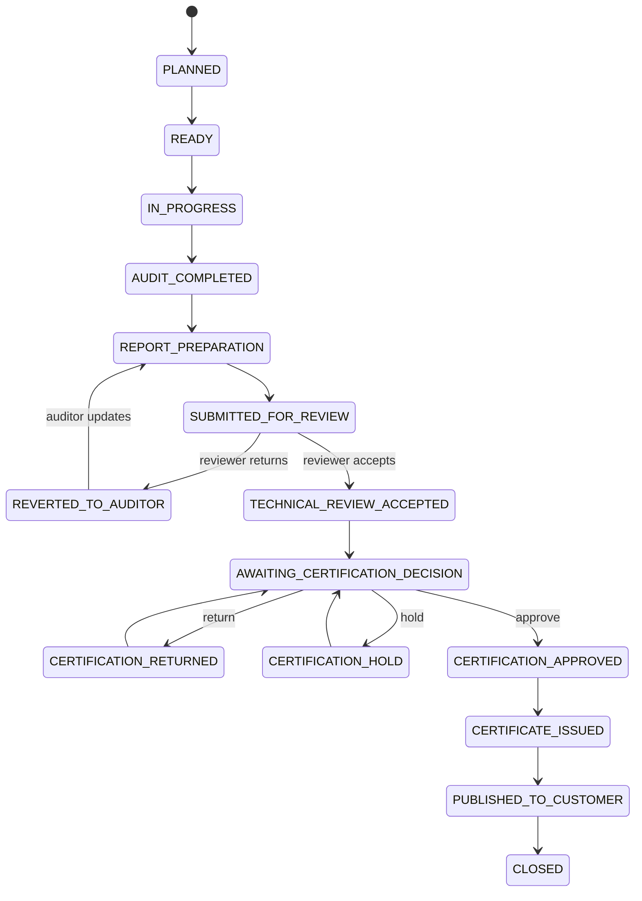

# Phase 1C — CB Operations & Customer Portal Architecture

**Project:** CB Auditor Webapp Community  
**Phase:** 1C — CB Operations & Customer Portal  
**Community baseline:** 10 August 2026

**Primary author / architecture lead**  
Nguyễn Đăng Quang  
Lead Auditor ISO/IEC 27001, ISO/IEC 42001, ISO/IEC 27701  
Project Lead – AI Governance and AIMS Platform Development

## 1. Purpose

Phase 1C extends the Phase 1A/1B auditor-facing architecture into Certification Body operations and controlled customer interaction.

The key architectural rule is:

> One web application, one Audit object and one primary data model. Role-specific workspaces are controlled projections over shared governed records, not copies of audit data.

Phase 1C adds operational workflow around the audit records already created by the auditor.

## 2. Scope

### In scope

- Reviewer / Technical Review workspace.
- Certification Decision workspace.
- Planner / Audit Coordinator workspace.
- Customer Portal.
- Role-aware audit assignments.
- Technical review return / re-submit / accept cycle.
- Independent certification decision.
- Customer finding response and evidence upload.
- Controlled customer publication.
- Manual reminders and notification records.
- Workflow history.
- Segregation of duties.

### Deferred

- Production SSO / identity federation.
- Full competence eligibility engine.
- Accreditation-specific rule engines.
- Automated certificate generation from accreditation templates.
- Qualified electronic signing.
- Complex multi-tenant CB hierarchy.
- ERP / CRM / finance integrations.
- Scheduled email/SMS escalation.
- Autonomous AI decisions.

## 3. Primary Actors

| Actor | Responsibility | Boundary |
|---|---|---|
| Auditor | Execute audit, prepare report, submit for review, review customer response | Internal |
| Reviewer | Independent technical review | Internal / authorized external |
| Certification Decision | Independent certification decision | Internal |
| Planner / Coordinator | Schedule, assign, coordinate, publish, remind | Internal |
| CB Admin | Users, roles and configuration | Internal |
| Customer Representative | View published data and submit corrective actions | External |

A user may hold multiple global roles, but audit-specific assignments determine whether that user may act on a specific audit.

## 4. Functional Architecture

## 5. End-to-End Workflow

### Workflow rules

- State changes are server-side domain commands.
- Every material transition creates a history record.
- Submitted report content is locked until returned by a Reviewer.
- Technical review acceptance is required before certification decision.
- Certification approval is required before certificate publication.
- Internal approval and customer publication are separate events.

## 6. Reviewer / Technical Review Module

### Purpose

Provide an independent checkpoint after the auditor completes and submits the audit package.

### Inputs

- Audit Overview.
- Audit plan and assignments.
- Scope, sites and audit duration.
- Team and competence summary where available.
- Findings and evidence.
- Management Summary.
- Conclusions.
- Statements.
- Technical Summary.
- Selected documents.
- Auditor recommendation.

### Outputs

- Review status.
- Review checklist responses.
- Reviewer comments.
- Return actions.
- Accepted review record.
- Review history.

### Reviewer actions

| Action | Result | Comment |
|---|---|---|
| Save Draft | Review remains in progress | Optional |
| Return to Auditor | Audit reopens authorized editable sections | Required |
| Accept Review | Audit advances to certification decision | Configurable |

### Baseline review checklist

- Scope verified.
- Audit duration acceptable.
- Team / competence acceptable.
- Audit plan available and consistent.
- Findings appropriately classified and evidence-supported.
- Conclusions consistent with evidence.
- Recommendation justified.
- Required documents available.

## 7. Certification Decision Module

### Purpose

Represent the independent decision checkpoint after technical review.

Use the domain term **Certification Decision**, not a generic approval flag.

### Inputs

- Audit and scheme identity.
- Audit type and dates.
- Sites and scope.
- Lead Auditor.
- Reviewer and accepted review result.
- Finding summary / closure state.
- Auditor recommendation.
- Reviewer conclusion.
- Certificate metadata where available.

### MVP outcomes

- Approve.
- Return for clarification.
- Hold.
- Reject.

### Business rules

- Decision cannot be approved without an accepted technical review.
- Decision action is independent from the auditor recommendation.
- Decision history is retained.
- Certificate publication requires an approved decision.

## 8. Planner / Audit Coordinator Module

### Purpose

Coordinate audit logistics, role assignments, customer access, publication and follow-up without taking over professional audit disposition.

### Functions

- Maintain schedule information.
- Maintain Lead Auditor and team assignments.
- Assign Reviewer and Certification Decision roles.
- Maintain onsite / remote attributes and planned days.
- Maintain customer contacts and portal access status.
- Publish eligible customer documents.
- Send manual reminders.

### Dashboard projections

- Upcoming audits.
- Audit Plan publication pending.
- Customer actions due / overdue.
- Audit packages awaiting review.
- Audits awaiting certification decision.
- Certificates awaiting publication.

### Restriction

Planner may remind and coordinate but cannot accept, reject or close findings.

## 9. Customer Portal

### Purpose

Provide a restricted customer-specific projection over approved/published data.

### Customer home

- Current certification summary.
- Upcoming audit information.
- Published Audit Plan.
- Open findings.
- Corrective-action due dates.
- Published documents.
- Approved and published certificate information.

### Corrective-action response

Customer response fields:

- Correction.
- Root Cause.
- Corrective Action.
- Evidence.

Responses may be saved as draft and submitted. Submitted responses are versioned and reviewed by the assigned auditor.

## 10. Document Publication

Storage and publication are separate.

A document existing in object storage or the internal document table is **not** evidence that the customer may access it.

Customer access requires:

1. an active customer authorization for the organization/audit; and
2. an active `CUSTOMER` publication record.

Publication stores:

- target audience;
- publication state;
- publisher;
- publication timestamp;
- optional withdrawal actor/time.

Withdrawal removes customer visibility without deleting the internal file.

## 11. Notifications & Reminders

Baseline events include:

- review assignment;
- audit submitted for review;
- audit returned to auditor;
- technical review accepted;
- certification decision requested;
- certification decision completed;
- portal invitation;
- finding response due soon / overdue;
- customer response submitted;
- customer response returned;
- certificate published.

For the Community MVP, reminders may be manual. The data model retains `due_at` and `sent_at` for future schedulers.

## 12. Authorization & Segregation of Duties

| Operation | Role | Condition |
|---|---|---|
| Submit audit for review | Auditor | Assigned audit; required content ready |
| Return / accept technical review | Reviewer | Active reviewer assignment |
| Make certification decision | Decision Maker | Accepted technical review |
| Manage scheduling | Planner | Authorized scope |
| Publish customer document | Planner / configured role | Eligible document |
| Submit corrective action | Customer | Authorized organization/audit |
| Accept / return response | Auditor | Assigned audit |
| Manage roles | CB Admin | Administrative privilege |

The service layer should support preventing self-review and self-approval.

## 13. API Considerations

Suggested module boundaries:

- Audit Service.
- Assignment Service.
- Review Service.
- Certification Decision Service.
- Finding Service.
- Document / Publication Service.
- Customer Portal Service.
- Notification / Reminder Service.

Portal queries should use customer-scoped authorization and projections. Internal fields must not be fetched and then merely hidden in the UI.

## 14. Non-Functional Requirements

- **Auditability:** actor/time/action traceability.
- **Authorization:** server-side role and object permission checks.
- **Integrity:** prerequisites enforced at transition time.
- **Versioning:** customer responses and review/decision cycles preserved.
- **Web-first:** offline operation not required.
- **Performance:** paginated and filterable work queues.
- **Security:** no cross-customer enumeration.
- **Privacy:** business-need minimization for contact/access records.
- **Recoverability:** workflow transition and history insert occur transactionally.
- **Observability:** failed transitions, permission denials and publication errors are logged.

## 15. Future Extensions

- production identity provider integration;
- configurable scheme-specific review checklists;
- reviewer eligibility from competence records;
- automated reminders;
- certificate rendering;
- digital signing;
- analytics and operational SLA dashboards;
- AI-assisted completeness and consistency checking.

AI remains advisory and cannot make autonomous certification decisions.
