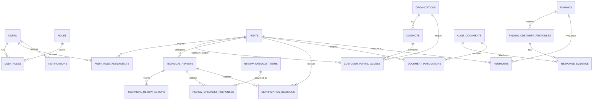

# Phase 1C — Data Model Extension

**Project:** CB Auditor Webapp Community  
**Phase:** 1C  
**Purpose:** Extend the Phase 1A/1B relational model for CB operations and controlled customer interaction.

## 1. Modeling Objective

Phase 1C adds identity, access, workflow, publication and customer-response entities around the existing Audit domain.

Existing `audits`, `findings`, `audit_documents`, sites and schemes remain the system of record.

Do not create separate copies of an audit for Reviewer, Certification Decision, Planner or Customer.

## 2. Modeling Principles

- UUID primary keys for business entities.
- Explicit foreign keys to `audit_id`, `organization_id` and `user_id`.
- Global roles separated from audit-specific assignments.
- Review and decision actions modeled as domain records, not only flags.
- Publication separated from file storage.
- Customer portal authorization separated from ordinary contacts.
- Submitted customer responses versioned.
- Status/history records append-only.
- Critical prerequisites enforced by database constraints where practical and by the service layer where contextual.
- Phase 1 remains simple enough for a modular monolith.

## 3. Phase 1C Entity Map

## 4. Identity and Roles

### `users`

Represents internal and external identities.

Important fields:

- `id`
- `email`
- `display_name`
- `user_type`
- `status`

### `roles`

Baseline role codes:

- `AUDITOR`
- `REVIEWER`
- `CERTIFICATION_DECISION`
- `PLANNER`
- `CB_ADMIN`
- `CUSTOMER`

### `user_roles`

Many-to-many global role membership.

Global role membership does not by itself authorize action on an audit.

### `audit_role_assignments`

Audit-specific operational assignment.

Important fields:

- `audit_id`
- `user_id`
- `role_code`
- `is_lead`
- `status`
- `assigned_by`
- `assigned_at`

## 5. Customer Portal Access

`customer_portal_access` authorizes a contact/user to access an organization and optionally a specific audit.

A customer's email appearing in `contacts` does not automatically grant portal access.

Access status baseline:

- `INVITED`
- `ACTIVE`
- `REVOKED`
- `EXPIRED`

## 6. Technical Review

`technical_reviews` is one review cycle record. Multiple historical cycles may exist for the same audit.

Status baseline:

- `PENDING`
- `IN_PROGRESS`
- `RETURNED`
- `ACCEPTED`

`technical_review_actions` stores individual comments, return actions and acceptance actions.

`review_checklist_items` stores reusable checklist definitions.

`review_checklist_responses` stores review-specific answers.

## 7. Certification Decision

`certification_decisions` stores the independent decision cycle.

Status:

- `PENDING`
- `APPROVED`
- `RETURNED`
- `HOLD`
- `REJECTED`

Decision type baseline:

- `GRANT`
- `MAINTAIN`
- `RENEW`
- `EXTEND`
- `REDUCE`
- `OTHER`

Critical rule: an approved certification decision must reference an accepted technical review.

## 8. Customer Finding Responses

`finding_customer_responses` stores versioned customer submissions.

Fields include:

- correction;
- root cause;
- corrective action;
- status;
- submitted by/at;
- auditor review;
- auditor comment.

Status:

- `DRAFT`
- `SUBMITTED`
- `REVERTED`
- `ACCEPTED`

`response_evidence` links a specific response version to a stored document.

## 9. Document Publication

`document_publications` separates visibility from storage.

Audience:

- `CUSTOMER`
- `AUDIT_TEAM`
- `INTERNAL_CB`

Status:

- `PUBLISHED`
- `WITHDRAWN`

A customer query must require both active access authorization and an active customer publication.

## 10. Notifications and Reminders

`notifications` stores user-facing event records.

`reminders` stores action follow-up with:

- audit/finding scope;
- recipient;
- `due_at`;
- `sent_at`;
- status;
- creator.

This supports manual MVP reminders and a later scheduler without redesign.

## 11. Workflow History

Existing audit and finding status histories remain append-only.

Review actions and decision cycles also preserve historical records through action/cycle rows.

Every state-changing service transaction should write history in the same transaction as the business state update.

## 12. Important Constraints

1. Reviewer must have an active Reviewer assignment for the audit.
2. Certification Decision user must have an active decision assignment.
3. Reviewer acceptance requires mandatory checklist completion.
4. Certification approval requires an accepted technical review.
5. Customer access requires active portal authorization.
6. Customer cannot edit auditor-owned finding content.
7. Auditor cannot accept a response before submission.
8. Planner cannot close findings.
9. A returned review unlocks only authorized auditor-editable content.
10. Customer publication may be withdrawn without deleting the internal document.

## 13. Query Projections

Recommended database views or application projections:

| Projection | Purpose |
|---|---|
| `review_queue_v` | Pending / returned / resubmitted technical reviews |
| `decision_queue_v` | Accepted reviews awaiting decision |
| `planner_followup_v` | Upcoming audits and due customer actions |
| `customer_portal_audits_v` | Customer-authorized audits |
| `customer_portal_documents_v` | Active customer publications |
| `open_customer_actions_v` | Findings awaiting customer action |

## 14. Migration Approach

1. Keep existing Phase 1A/1B business records.
2. Add `users`, roles and role assignments.
3. Link existing auditor identities to `users` progressively.
4. Extend the Technical Review model.
5. Add Certification Decision.
6. Add portal authorization.
7. Add versioned customer response records and response evidence.
8. Add publication records.
9. Add reminder / notification records.
10. Normalize/backfill workflow history.

See [`database/phase-1c-extension.sql`](../../database/phase-1c-extension.sql).
