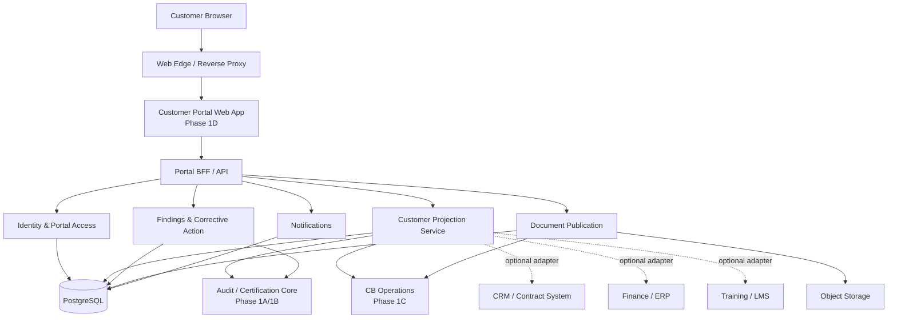
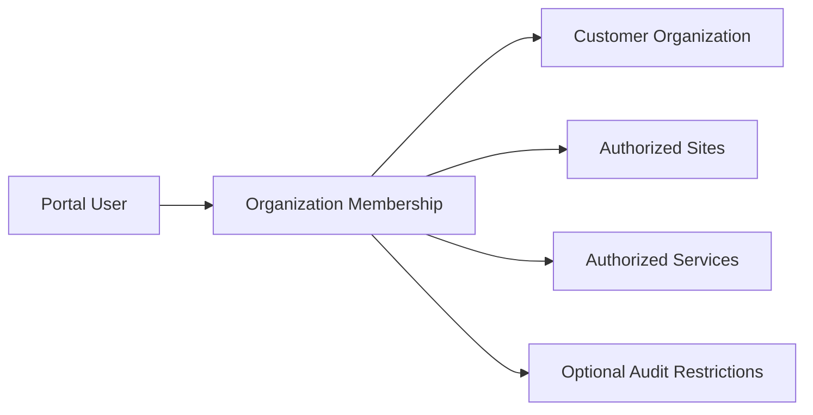
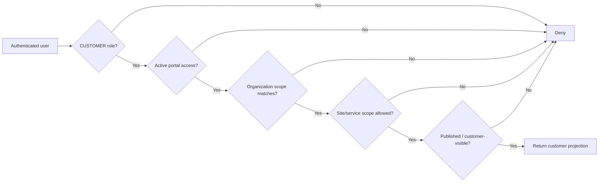
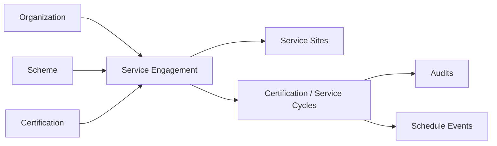
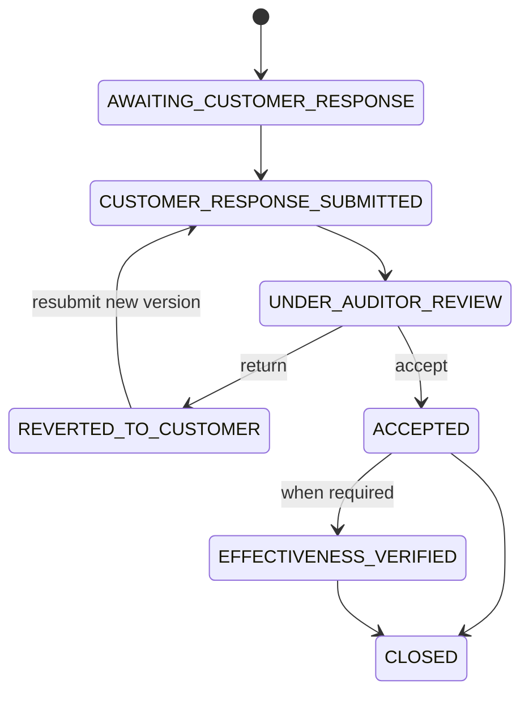

# Phase 1D — Customer Portal Architecture

**Project:** CB Auditor Webapp Community  
**Phase:** 1D — Customer Portal  
**Community baseline:** 14 August 2026  

**Primary author / architecture lead**  
Nguyễn Đăng Quang  
Lead Auditor ISO/IEC 27001, ISO/IEC 42001, ISO/IEC 27701  
Project Lead – AI Governance and AIMS Platform Development

## 1. Purpose

Phase 1D promotes the customer-facing experience into a first-class web application boundary.

Phase 1C remains focused on Certification Body operations: Reviewer, Certification Decision, Planner / Coordinator, publication and governed workflow. Phase 1D focuses on the external customer experience and the identity, authorization, service aggregation and portal projections required to support it safely.

The core rule remains unchanged:

> One governed source of truth. The Customer Portal is a customer-scoped projection over shared certification and audit records, not a second audit database.

## 2. Business-analysis baseline

The Phase 1D baseline is informed by observed customer-portal behavior and by the existing Community domain model. The initial portal experience demonstrates these generic capabilities:

- customer sign-in using an email-linked portal identity;
- customer Overview / dashboard;
- navigation areas for Contracts, Schedule, Audits, Findings, Financials, Certificates, Trainings and additional applications;
- a **My Services** view that can filter by company, service and site;
- service cards grouped by management-system standard / certification service;
- yearly views of service progress;
- progress indicators for Schedule, Audit, Findings and Certificates;
- upcoming-audit calendar information;
- customer-scoped financial and training summary extension points.

No proprietary screenshots, protected wording, internal URLs, implementation code or confidential identifiers are part of this Community architecture.

## 3. Phase boundaries

| Phase | Primary boundary | Main actors |
|---|---|---|
| Phase 1A | Application foundation and audit metadata | Auditor |
| Phase 1B | Detailed audit execution workspace | Auditor, Lead Auditor |
| Phase 1C | CB operations and governed downstream workflow | Reviewer, Certification Decision, Planner / Coordinator, CB Admin |
| **Phase 1D** | **Customer web portal, customer identity and customer-scoped service projections** | **Customer Representative** |

Phase 1D supersedes the lightweight Customer Portal assumptions documented inside Phase 1C. Phase 1C documents are retained as architecture history and because they still define the CB-side publication and corrective-action workflow that Phase 1D consumes.

## 4. Scope

### 4.1 Core Phase 1D scope

- Customer sign-in boundary and portal identity model.
- Customer membership to one or more organizations.
- Organization / company, service and site scoped authorization.
- Customer Overview dashboard.
- My Services aggregation.
- Year-based service progress projection.
- Schedule / upcoming-audit projection.
- Audits projection.
- Findings and corrective-action response workflow.
- Certificates projection.
- Customer-visible documents.
- Saved portal filter preferences.
- Customer notification surface.
- Audit trail for security-sensitive portal actions.

### 4.2 Extended domains / integration-ready boundaries

The portal navigation may expose these areas, but the first Community implementation may use placeholders or adapters:

- Contracts.
- Financials / invoices / payment status.
- Trainings.
- More Apps / external service links.

These are deliberately separated from the audit core so that ERP, CRM, LMS or finance integrations can be added later without polluting the audit model.

### 4.3 Deferred production hardening

- Production SSO / identity federation.
- MFA policy and recovery flows.
- External IdP lifecycle automation.
- Advanced delegated customer administration.
- Complex parent/subsidiary tenant hierarchy.
- ERP / finance integration.
- LMS integration.
- Automated contract synchronization.
- Full notification delivery adapters.
- Rate-limiting, WAF and enterprise edge controls.

## 5. High-level architecture

The recommended implementation remains a modular monolith first. The Customer Portal may be deployed as a separate web frontend, but the authoritative business data stays in the shared domain database and services.

## 6. Customer identity model

A customer organization is not the same thing as a portal user.

Recommended concepts:

- `users`: generalized application identity from Phase 1C;
- `contacts`: business contact master;
- `customer_portal_access`: invitation / activation / revocation record from Phase 1C;
- `customer_portal_site_access`: optional site allow-list;
- `customer_portal_service_access`: optional service allow-list;
- `portal_dashboard_preferences`: user-specific saved filters and display preferences.

A customer may have multiple contacts. A contact may have a portal identity. A portal identity may be authorized for more than one organization where business rules permit.

## 7. Authorization model

Portal authorization must be evaluated server-side on every request.

### 7.1 Minimum authorization decision

### 7.2 Important rules

- UI hiding is not authorization.
- Internal-only columns must not be serialized to portal clients.
- Organization IDs supplied by a browser are never trusted by themselves.
- Customer-visible documents require explicit publication.
- Finding text, classification, requirement reference and auditor evidence remain read-only to customers.
- Customer corrective-action drafts are editable only by appropriately authorized customer users.
- Submitted corrective-action versions are immutable historical records; revisions create a new version.
- Revoked access takes effect without deleting audit history.

## 8. Customer Overview / My Services

The Overview page is a projection, not a table.

### 8.1 Filter dimensions

- Company / organization.
- Certification service / scheme.
- Site.
- Calendar year.

Saved filters are user preferences and do not change authorization.

### 8.2 Service card

A service card represents a customer service engagement, typically linked to a scheme / standard and optional certification record.

Suggested progress measures:

| Measure | Example meaning |
|---|---|
| Schedule | confirmed schedule items / total relevant schedule items |
| Audit | completed audits / total audits in selected year |
| Findings | closed findings / total customer-visible findings |
| Certificates | issued/published certificates / total certificate records |

Counts should be calculated from source records. Avoid storing dashboard counters as authoritative state unless a performance cache is introduced later.

## 9. Service engagement and certification cycle

The existing `certifications` table identifies an organization + scheme certification. Phase 1D adds a customer-facing **service engagement** abstraction so that the portal can group activities consistently even when an engagement spans multiple audits, sites or years.

A service engagement is not intended to replace the Certification Body's commercial contract system. It is the minimum portal-facing service identity needed to aggregate audit and certification activity.

## 10. Schedule model

Audit scheduling and audit execution are related but distinct.

A schedule event may exist before an executable `audit` record is finalized. The Phase 1D model therefore adds `audit_schedule_events` with an optional `audit_id`.

Suggested status values:

- `PROPOSED`
- `NOT_CONFIRMED`
- `CONFIRMED`
- `RESCHEDULE_REQUESTED`
- `CANCELLED`
- `COMPLETED`

The portal can use this model for upcoming-audit calendars without overloading `audits.status`.

## 11. Audits projection

Customer audit pages should expose only customer-approved fields such as:

- audit type;
- date range;
- relevant site(s);
- relevant scheme(s);
- scope where customer-visible;
- published plan / documents;
- high-level audit status;
- published outcome information.

Internal reviewer notes, competence details, internal assignment comments, internal evidence and certification-decision deliberations are excluded.

## 12. Findings and customer corrective action

Phase 1D uses the Phase 1C finding workflow:

Customer input may include:

- Correction.
- Root Cause.
- Corrective Action.
- Supporting evidence.

Portal write operations must be transactional and generate audit-trail records.

## 13. Certificates projection

Customer certificate visibility requires:

1. the customer is authorized for the organization/service/site scope;
2. the certification decision and issuance prerequisites have been satisfied;
3. the certificate record is in a customer-visible state;
4. any certificate document has an active customer publication record.

The portal may show certificate reference, scheme/standard, issue date, expiry date, approved scope, applicable sites and downloadable published document.

## 14. Contracts, Financials and Trainings

These navigation areas are modeled as **external-domain projections**.

### Contracts

Possible future source: CRM / contract management. The portal should preferably store only stable references and customer-safe projection data where needed.

### Financials

Possible future source: ERP / finance. The audit system should not become the accounting ledger. A future adapter may expose invoice number, issue date, due date, amount/currency and payment state.

### Trainings

Possible future source: LMS. A future adapter may expose training enrollment/completion summary relevant to the customer.

No detailed Phase 1D schema is mandated for these domains until additional BA evidence exists.

## 15. API boundary

Suggested portal routes are architecture guidance, not a final API contract.

| Boundary | Example resources | Responsibility |
|---|---|---|
| Session | `/portal/session`, `/portal/me` | Current portal identity and customer memberships |
| Overview | `/portal/overview` | Customer-scoped aggregate dashboard |
| Services | `/portal/services` | Service engagement cards and year projections |
| Schedule | `/portal/schedule` | Upcoming / historical schedule items |
| Audits | `/portal/audits` | Customer-safe audit projections |
| Findings | `/portal/findings` | Customer-visible findings |
| Responses | `/portal/findings/{id}/responses` | Draft / submit corrective action |
| Certificates | `/portal/certificates` | Issued/published certificate projection |
| Documents | `/portal/documents` | Published documents only |
| Preferences | `/portal/preferences` | Saved filters and portal preferences |
| Notifications | `/portal/notifications` | Customer notification records |

## 16. Data ownership

| Data | Customer read | Customer write | Authoritative owner |
|---|---:|---:|---|
| Organization / site identity | Yes, scoped | No | CB master data |
| Service / scheme | Yes, scoped | No | CB service master |
| Audit schedule | Yes, scoped | Future confirmation action only | Planner / scheduling |
| Audit record | Yes, published projection | No | Auditor / CB |
| Finding statement | Yes, published | No | Auditor |
| Corrective-action response | Yes | Draft / submit | Customer + auditor review |
| Customer response evidence | Yes | Upload per policy | Customer |
| Certificate | Yes, when published | No | CB certification process |
| Published document | Yes | No | CB publication process |
| Portal preferences | Yes | Yes | Customer user |

## 17. Security baseline

Phase 1D introduces a real external attack surface and therefore requires stronger controls than the single-user Phase 1A demonstration.

Minimum design requirements:

- unique email-linked identity;
- secure password or external IdP implementation in a production deployment;
- MFA-ready identity boundary;
- server-side RBAC + object-level authorization;
- session expiry and revocation;
- CSRF protection when cookie-based sessions are used;
- secure cookies (`HttpOnly`, `Secure`, appropriate `SameSite`) where applicable;
- rate limiting on authentication and sensitive writes;
- no sequential customer-facing identifiers where enumeration would create risk;
- signed / time-limited object-storage download URLs;
- audit logging for sign-in, access changes, submissions and document downloads where required;
- privacy minimization for customer contact data;
- secrets excluded from browser bundles and repository history.

Production authentication implementation is still a later hardening activity; the Phase 1D schema establishes the required domain boundary now.

## 18. Non-functional requirements

- **Web-first:** no desktop installation requirement for customers.
- **Tenant isolation:** no cross-customer enumeration or leakage.
- **Auditability:** material customer actions record user, timestamp and object.
- **Integrity:** customer writes cannot bypass finding workflow rules.
- **Performance:** dashboard aggregates should use indexed customer-scope queries; materialized views may be introduced later.
- **Accessibility:** customer portal UI should support keyboard navigation, semantic labels and clear status presentation.
- **Localization-ready:** service names, dates and customer-facing text should not assume one language.
- **Observability:** permission denials, failed submissions and publication errors should be logged without exposing sensitive data.

## 19. Implementation sequence

Recommended Community sequence:

1. Apply Phase 1A/1B schema.
2. Apply `database/phase-1c-extension.sql`.
3. Apply `database/phase-1d-extension.sql`.
4. Seed one customer organization, multiple sites and multiple schemes.
5. Create a customer `users` identity and active `customer_portal_access`.
6. Create service engagements and service/site scopes.
7. Build `/portal/overview` projection.
8. Build Schedule, Audits, Findings and Certificates views.
9. Enable finding-response writes with object-level authorization.
10. Add authentication hardening before internet-facing production use.

## 20. Phase 1D deliverables in this repository

- `docs/architecture/phase-1d-customer-portal-architecture.md`
- `docs/architecture/phase-1d-data-model-extension.md`
- `docs/domain/phase-1d-customer-portal-domain.md`
- `database/phase-1d-extension.sql`
- `database/PHASE_1D_ERD.md`
- `PHASE_1D_COMMUNITY_MIGRATION_REPORT.md`

