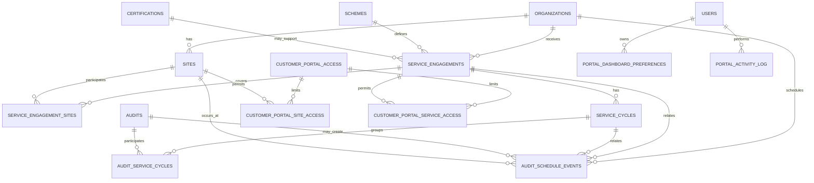

# Phase 1D — Customer Portal Data Model Extension

**Project:** CB Auditor Webapp Community  
**Phase:** 1D — Customer Portal  
**Community baseline:** 14 August 2026

## 1. Purpose

This document extends the Phase 1A/1B core schema and Phase 1C CB Operations extension to support a customer-facing web portal.

The extension is intentionally additive. Existing audit, finding, certification and document records remain authoritative.

## 2. Existing dependencies

Phase 1D assumes these existing Phase 1A/1B tables:

- `organizations`
- `sites`
- `contacts`
- `standards`
- `schemes`
- `certifications`
- `audit_projects`
- `audits`
- `audit_sites`
- `audit_schemes`
- `findings`
- `audit_documents`

Phase 1D also assumes these Phase 1C concepts:

- `users`
- `roles`
- `user_roles`
- `customer_portal_access`
- `finding_customer_responses`
- `response_evidence`
- `document_publications`
- notification / audit-trail concepts where present.

## 3. New entities

### 3.1 `service_engagements`

Customer-facing service identity used to aggregate schedule, audits, findings and certificates.

Key fields:

- `organization_id`
- `scheme_id`
- optional `certification_id`
- `service_code`
- `display_name`
- `status`
- `valid_from`, `valid_until`

This table is not a commercial contract ledger. It is a stable portal aggregation identity.

### 3.2 `service_engagement_sites`

Many-to-many relationship between a service engagement and customer sites.

### 3.3 `service_cycles`

Optional year/cycle grouping for customer service activity.

Key fields:

- `service_engagement_id`
- `cycle_label`
- `cycle_year`
- `start_date`, `end_date`
- `status`

### 3.4 `audit_service_cycles`

Bridge from existing `audits` to a portal service cycle.

An audit may participate in more than one service cycle for integrated/multi-scheme cases. The bridge therefore avoids putting one `service_cycle_id` directly on `audits`.

### 3.5 `audit_schedule_events`

Schedule lifecycle that can exist before or independently of final audit execution.

Key fields:

- `organization_id`
- optional `service_engagement_id`
- optional `service_cycle_id`
- optional `audit_id`
- optional `site_id`
- `event_type`
- `status`
- start/end date-time
- customer-visible flag

### 3.6 `customer_portal_site_access`

Optional site allow-list under an existing `customer_portal_access` record.

Rule: if no site-specific rows exist for an access grant, organization-level access may apply according to service policy. If rows exist, they narrow the scope.

### 3.7 `customer_portal_service_access`

Optional service-engagement allow-list under an existing portal access grant.

### 3.8 `portal_dashboard_preferences`

Stores non-security user preferences such as saved organization, service, site and selected year.

Authorization must never be inferred from preferences.

### 3.9 `portal_activity_log`

Append-oriented trace of security/material customer actions.

Examples:

- portal activation;
- login success/failure events where application policy stores them;
- filter preference changes (optional);
- finding-response draft/submission;
- document access;
- certificate access;
- schedule acknowledgement if implemented later.

Sensitive authentication telemetry may instead be held by an external identity provider; this table is not intended to duplicate full IdP logs.

## 4. Relationship overview



## 5. Customer Overview is a projection

Do not create a `customer_overview` table as the primary source of truth.

The Overview endpoint should aggregate authorized source records.

Example logical projection:

```text
PortalUser
  -> active customer_portal_access
  -> authorized Organization
  -> authorized ServiceEngagement[]
       -> selected year / ServiceCycle
       -> Schedule progress
       -> Audit progress
       -> Findings progress
       -> Certificate progress
```

## 6. Suggested service-card calculations

### Schedule

```text
confirmed = count(schedule events where status = CONFIRMED)
total     = count(customer-visible schedule events in selected year)
```

### Audit

```text
completed = count(audits in selected year with customer-safe completed state)
total     = count(relevant audits in selected year)
```

### Findings

```text
closed = count(customer-visible findings with status = CLOSED)
total  = count(customer-visible findings)
```

### Certificates

```text
issued = count(authorized certificate records in an issued/published state)
total  = count(relevant certificate records)
```

Exact state mapping should be implemented in the application/domain layer rather than duplicated in multiple SQL queries.

## 7. Authorization query pattern

A portal request for an object should establish:

1. current `users.id`;
2. global CUSTOMER role where required;
3. active `customer_portal_access`;
4. matching `organization_id`;
5. matching optional site/service allow-list;
6. matching optional audit restriction from Phase 1C;
7. customer visibility / publication state for the requested record.

A common application authorization function should be used rather than ad-hoc conditions in every handler.

## 8. Integrated and multi-scheme audits

Because the core model already supports multiple `audit_schemes`, Phase 1D does not force a one-audit-to-one-service relationship.

`audit_service_cycles` allows an integrated audit to contribute to multiple service cards/cycles while retaining one Audit aggregate.

## 9. Multi-site customers

`service_engagement_sites` identifies which sites are part of a service engagement.

`customer_portal_site_access` identifies which of those sites a particular portal access grant may see.

These are different concepts:

- service scope = business/service coverage;
- portal site access = user authorization.

## 10. Customer contact and user identity

The Phase 1C extension links `contacts.user_id` to `users.id` and provides `customer_portal_access`.

Phase 1D keeps this model and adds narrower scopes rather than creating a duplicate customer-user table.

Recommended invariant:

- one active login identity is represented by one `users` row;
- business contact information remains in `contacts`;
- access grant/history remains in `customer_portal_access`;
- access scoping remains in dedicated join tables.

## 11. Publication and visibility

The following should not be inferred merely from record existence:

- audit document visibility;
- certificate document visibility;
- internal review information;
- internal evidence;
- certification decision deliberation.

Use explicit customer-visible fields and/or `document_publications` as appropriate.

## 12. Financial / contract / training domains

No detailed relational model is added in this Phase 1D extension because current BA evidence establishes navigation and summary concepts, but not sufficient authoritative field/workflow definitions.

Recommended future patterns:

- `external_contract_refs` or contract projection table backed by CRM;
- `invoice_projections` backed by ERP/finance;
- `training_projections` backed by LMS.

These should be added only when the source-of-truth relationship and data ownership are understood.

## 13. Indexing guidance

Phase 1D adds indexes optimized for:

- service list by organization/status;
- service cycle by engagement/year;
- schedule by organization/start time/status;
- portal scopes by access record;
- portal activity by user/time and organization/time.

For larger installations, consider additional indexes based on real query plans and cardinality.

## 14. Migration strategy

Reference migration order:

```bash
psql <database> < database/schema.sql
psql <database> < database/phase-1c-extension.sql
psql <database> < database/phase-1d-extension.sql
```

This is architecture-oriented SQL. Production deployments should use a migration framework, schema version tracking, backups, rollback planning and environment-specific testing.

## 15. Compatibility

The Phase 1D extension intentionally avoids destructive changes to Phase 1A/1B/1C core tables.

The main compatibility choice is to reuse `customer_portal_access` instead of creating a new portal identity system.

