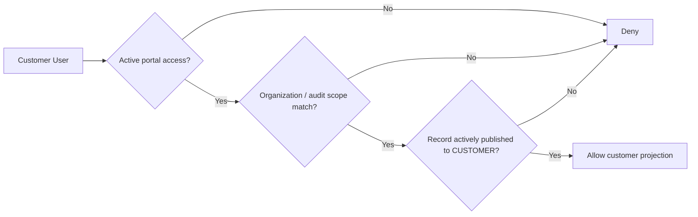
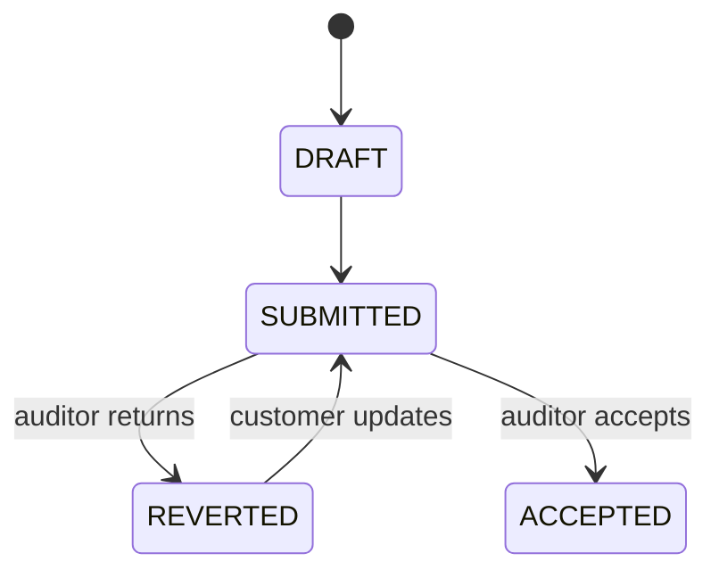

# Customer Portal Model

## Purpose

Define a secure customer-facing projection without exposing internal CB records.

The Customer Portal is not a second audit database.

## Visibility Principle

## Customer Home

The Community architecture may expose:

- certification summary;
- upcoming audit date/type;
- published Audit Plan;
- open findings;
- due corrective actions;
- customer-published documents;
- approved/published certificate information.

## Portal Access

A contact record is not an authorization record.

`customer_portal_access` should identify:

- customer contact/user;
- organization;
- optional audit restriction;
- access status;
- invitation time;
- activation time;
- revocation/expiry as needed.

## Customer Corrective Action

Customer inputs:

- Correction.
- Root Cause.
- Corrective Action.
- Evidence.

Submitted versions should not be silently overwritten.

## Data Ownership

Customer may edit:

- their own draft response;
- their own supporting response evidence before/according to submission rules.

Customer may not edit:

- finding statement;
- requirement reference;
- finding classification;
- auditor evidence;
- technical review;
- certification decision;
- internal notes.

## Document Access

Document storage and publication are independent.

A customer may access a document only when:

- their portal authorization is active;
- scope matches;
- the document has an active `CUSTOMER` publication.

## Security Requirements

- No enumeration of other organizations.
- Object-level authorization on every portal request.
- Prefer customer-scoped query projections.
- Internal-only fields should not be serialized to portal clients.
- Publication withdrawal takes effect without deleting internal history.
