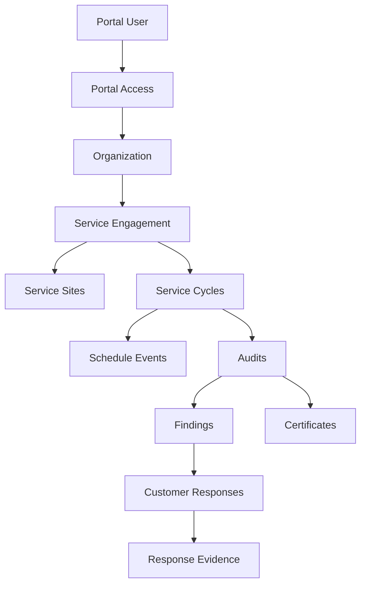

# Phase 1D — Customer Portal Domain Model

## Purpose

Define the customer-facing domain boundary for CB Auditor Webapp Community Phase 1D.

The portal is an external projection over governed audit and certification data. It does not own or duplicate the audit record.

## Domain concepts

### Portal User

A generalized `users` identity with customer role and one or more active portal access grants.

### Customer Organization

The legal/business entity represented by `organizations`.

### Customer Membership / Portal Access

An authorization grant represented by `customer_portal_access`.

A contact record alone does not grant portal access.

### Service Engagement

A customer-facing certification/service relationship that groups scheme, certification, sites, cycles, audits and schedule activity.

### Service Cycle

A year/cycle grouping used for service history and progress views.

### Schedule Event

A customer-visible scheduling item. It is separate from audit execution because scheduling may exist before a final audit record or may be rescheduled without changing historical audit execution data.

### Audit Projection

Customer-safe subset of the Audit aggregate.

### Finding Projection

Customer-visible finding content plus corrective-action workflow.

### Certificate Projection

Customer-safe issued/published certificate metadata and published documents.

## Aggregate view



## Customer Overview

The Overview is read-model composition. It should answer:

- Which organizations can this user see?
- Which certification services can this user see?
- Which sites can this user see?
- What is the progress for each service in the selected year?
- What audits are upcoming?
- Which findings require customer action?
- Which certificates are issued/published?

The Overview must never broaden the user's underlying authorization.

## Access-scoping rules

1. An active portal access record establishes organization scope.
2. Optional site rows narrow site scope.
3. Optional service rows narrow service scope.
4. Optional Phase 1C `audit_id` scope may narrow access to one audit.
5. Publication/customer-visible status is still required for restricted content.
6. Saved filters are presentation preferences only.

## Service progress

A service card is a calculated projection.

```text
Service Engagement + selected year
    -> Schedule progress
    -> Audit progress
    -> Finding closure progress
    -> Certificate issuance progress
```

Do not update service-card counters independently of source records.

## Customer finding response

Customer can write only within the corrective-action boundary.

Customer-controlled fields:

- Correction
- Root Cause
- Corrective Action
- Supporting evidence

Customer cannot modify:

- finding statement;
- classification;
- requirement reference;
- auditor evidence;
- auditor comments;
- technical-review information;
- certification decision.

## Versioning rule

Submitted response content is historical evidence and must not be silently overwritten.

A returned response should create or activate the next editable version according to implementation policy.

## Publication rule

A record may exist internally without being customer-visible.

For documents:

```text
Authorized user
+ matching organization/site/service/audit scope
+ active CUSTOMER publication
= downloadable portal document
```

## Schedule states

Reference states:

- PROPOSED
- NOT_CONFIRMED
- CONFIRMED
- RESCHEDULE_REQUESTED
- CANCELLED
- COMPLETED

These are customer scheduling states, not replacements for the audit execution lifecycle.

## Portal activity events

Recommended material events:

- PORTAL_ACCESS_ACTIVATED
- PORTAL_ACCESS_REVOKED
- FINDING_RESPONSE_DRAFT_SAVED
- FINDING_RESPONSE_SUBMITTED
- DOCUMENT_VIEWED
- DOCUMENT_DOWNLOADED
- CERTIFICATE_VIEWED
- SCHEDULE_VIEWED
- SCHEDULE_ACKNOWLEDGED (future)

Not every UI click needs to be logged. Focus on security, evidence and workflow-significant actions.

## External domain boundaries

Contracts, Financials and Trainings should be represented as adapters/projections until their authoritative systems and workflow requirements are known.

The audit database should not become:

- the commercial contract ledger;
- the accounting ledger;
- the learning-management system.

## Invariants

- Portal user identity is separate from customer organization identity.
- One organization may have multiple portal users.
- One user may have multiple authorized organization memberships when explicitly granted.
- Integrated audits remain one Audit aggregate.
- Customer read models never become authoritative audit data.
- Customer write access is narrowly defined and auditable.
- Internal data is not fetched and then merely hidden in the browser.

