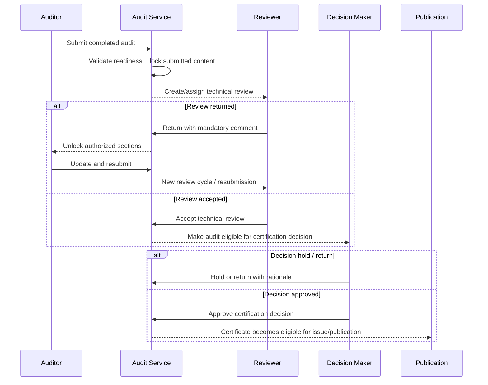

# Technical Review & Certification Decision Workflow

## Purpose

Keep audit execution, independent technical review and independent certification decision as separate lifecycles.

An auditor recommendation is not a certification decision.

## Workflow

## Technical Review States

- `PENDING`
- `IN_PROGRESS`
- `RETURNED`
- `ACCEPTED`

## Technical Review Data

- reviewer;
- audit;
- revision number;
- timestamps;
- review summary;
- checklist responses;
- action/comment history.

## Review Return Rule

A return must contain a comment and should identify the relevant section when practical, for example:

- findings;
- management summary;
- conclusions;
- statements;
- technical summary;
- documents.

Only authorized auditor-editable content should reopen.

## Certification Decision States

- `PENDING`
- `APPROVED`
- `RETURNED`
- `HOLD`
- `REJECTED`

## Certification Decision Types

- `GRANT`
- `MAINTAIN`
- `RENEW`
- `EXTEND`
- `REDUCE`
- `OTHER`

## Integrity Rules

- Decision cannot be approved until technical review is accepted.
- The accepted review used for the decision is referenced explicitly.
- Decision history is preserved by cycle/revision.
- Approval does not automatically publish a certificate.
- Publication is a separate controlled action.
