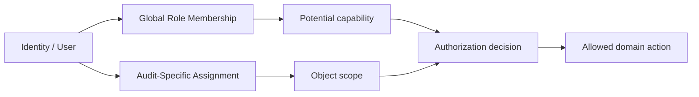

# Role & Permission Model

## Purpose

Define a Community Edition authorization model that separates:

- who a person is;
- which global roles they may hold;
- which audit they are assigned to;
- which actions they may perform on that audit;
- which records an external customer may view.

## Role Layers

A global role alone is insufficient for sensitive audit actions.

## Baseline Roles

| Role | Main capability |
|---|---|
| `AUDITOR` | Execute audit and review customer corrective action |
| `REVIEWER` | Technical review |
| `CERTIFICATION_DECISION` | Independent certification decision |
| `PLANNER` | Schedule, assign, publish and remind |
| `CB_ADMIN` | User/role/configuration management |
| `CUSTOMER` | Restricted customer portal access |

## Audit-Specific Assignment

`audit_role_assignments` scopes internal operational roles to a specific audit.

Suggested states:

- `ASSIGNED`
- `ACTIVE`
- `REMOVED`
- `COMPLETED`

## Authorization Matrix

| Action | Auditor | Reviewer | Decision | Planner | Customer |
|---|---:|---:|---:|---:|---:|
| Edit audit execution content | ✓ | — | — | limited | — |
| Submit for review | ✓ | — | — | — | — |
| Return/accept technical review | — | ✓ | — | — | — |
| Make certification decision | — | — | ✓ | — | — |
| Maintain scheduling | limited | — | — | ✓ | — |
| Publish eligible customer item | — | — | — | ✓ / configured | — |
| Submit corrective action | — | — | — | — | ✓ |
| Accept/return customer response | ✓ | — | — | — | — |
| Send reminder | limited | — | — | ✓ | — |
| Close finding | ✓ | — | — | — | — |

Actual policy may be configured per scheme, but the domain separation should remain.

## Segregation of Duties

The system should support:

- no self-review of an audit where the user acted as auditor;
- no self-approval where prohibited;
- independent technical review and certification decision;
- no certification decision before review acceptance;
- no planner disposition of findings.

An exception mechanism, if later introduced, should be explicit, authorized and auditable.

## Customer Authorization

Customer access is two-dimensional:

1. **identity/access scope** — the user is authorized to the organization/audit;
2. **publication scope** — the specific record/document is customer-published.

Both conditions must hold.

## Service-Layer Rule

Authorization should be enforced in the application/service layer and supported by database constraints/indexes where possible.

UI visibility is not an authorization control.
